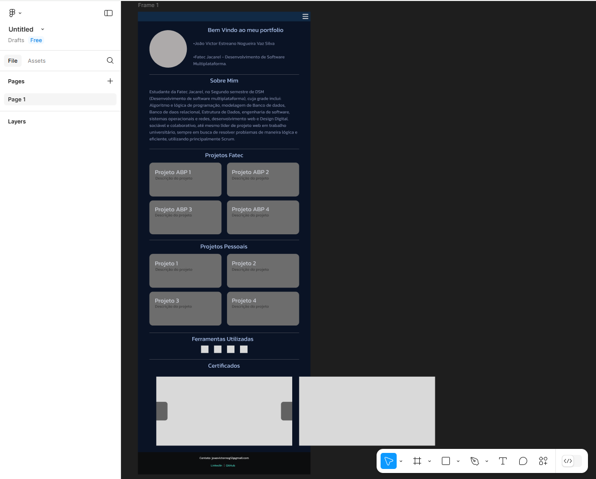

# Portfólio Pessoal - Desenvolvimento em Andamento

Este repositório contém o desenvolvimento completo do meu portfólio pessoal, desde as primeiras ideias e rascunhos de design até o resultado final. O projeto está em andamento e será atualizado conforme novas etapas de desenvolvimento forem concluídas.

## 🚀 Objetivo

O objetivo deste portfólio é apresentar minhas habilidades, projetos anteriores e meu processo criativo como desenvolvedor/designer. O repositório acompanha o progresso desde a concepção do design até a implementação, permitindo que os visitantes vejam como o portfólio evolui ao longo do tempo.

## 📝 Índice

1. [Ideias Iniciais](#-ideias-iniciais)
2. [Design e Layout](#-design-e-layout)
3. [Desenvolvimento Front-End](#-desenvolvimento-front-end)
4. [Progresso Atual](#-progresso-atual)
5. [Tecnologias Utilizadas](#-tecnologias-utilizadas)

## 🖋️ Ideias Iniciais

Aqui serão registradas as primeiras ideias sobre como o portfólio deve ser estruturado e o que deve ser destacado. Serão incluídos esboços, brainstorming e discussões sobre a identidade visual e as funcionalidades do portfólio.

## 🎨 Design e Layout

Nesta seção, vou documentar a evolução do design visual, incluindo wireframes, protótipos e quaisquer alterações feitas no layout. A ideia é apresentar como o design foi aprimorado ao longo do tempo.

- Protótipos iniciais
- Escolha de paleta de cores
- Tipografia
- Mockups

 Este a seguir é (há principio) o design final para o portfólio, mas passivel de alterações ao longo do Projeto

  
  

## 💻 Desenvolvimento Front-End

Aqui será documentado o desenvolvimento da interface do usuário, incluindo tecnologias utilizadas, componentes desenvolvidos, desafios enfrentados e como a experiência do usuário foi aprimorada.

- HTML, CSS, JavaScript
- Responsividade
- Interatividade e animações

## 📈 Progresso Atual

Aqui vou compartilhar o andamento atual do projeto, mostrando a versão mais recente do portfólio, funcionalidades implementadas e próximas etapas planejadas.

**Última atualização:** 13 de fevereiro de 2025  
**Status:** Em andamento

### Funcionalidades Implementadas:
- [ ] Página inicial com introdução
- [ ] Seção de projetos 
- [ ] Seção de Ferramentas
- [ ] Seção de Certificados
- [ ] hamburger Menu
- [ ] Switcher de Idioma
- [ ] Switcher de Tema

### Próximas Etapas:
- [ ] Finalizar o design 
- [ ] Criar Logo Pessoal em PaintToolSai
- [ ] Responsividade

## 🛠️ Tecnologias Utilizadas

A seguir, as principais tecnologias utilizadas no desenvolvimento do portfólio:

- **Front-End:**
  - HTML
  - CSS
  - JavaScript
- **Ferramentas de Design:**
  - Figma
